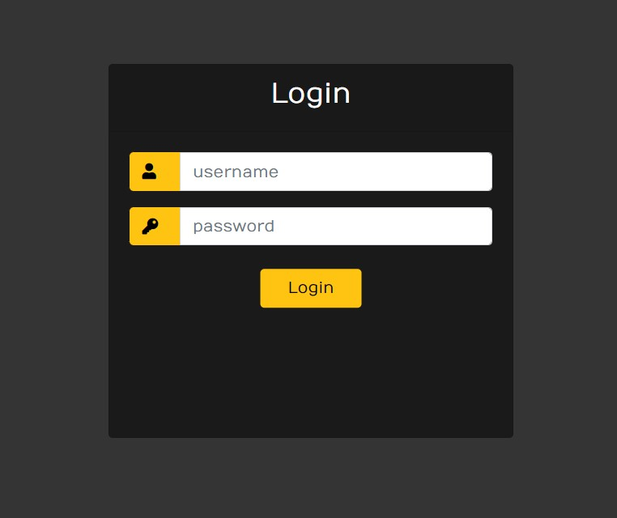
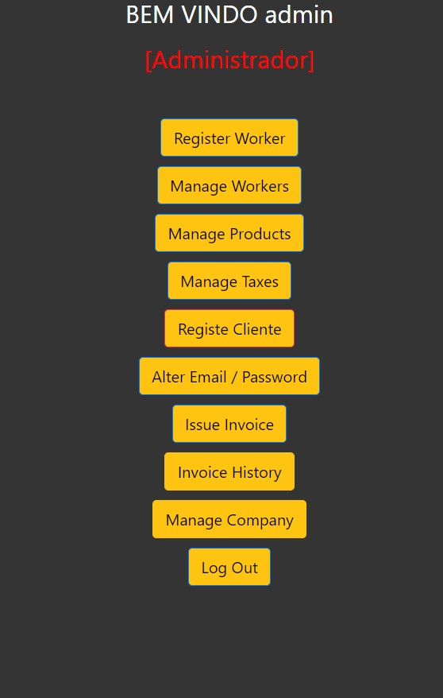
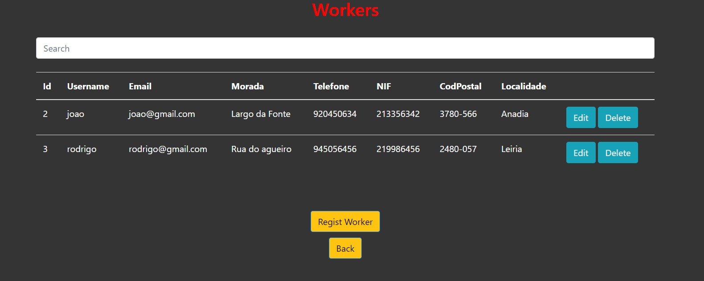
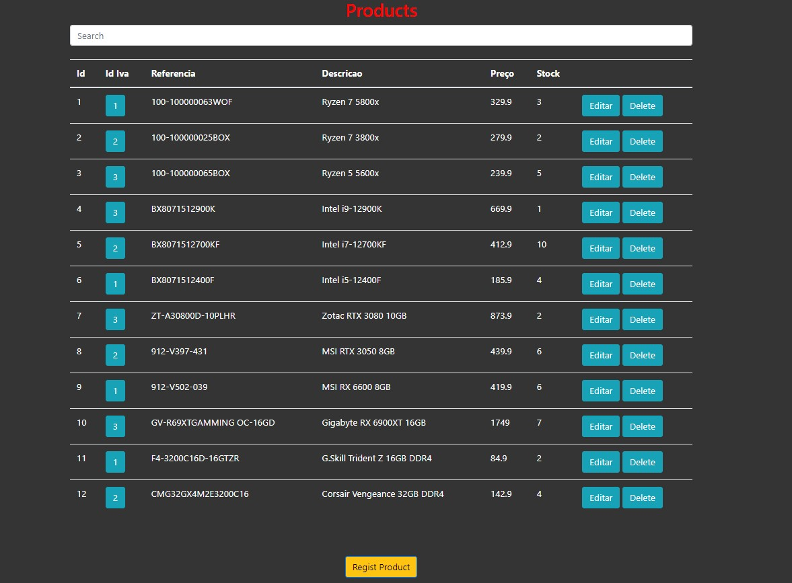
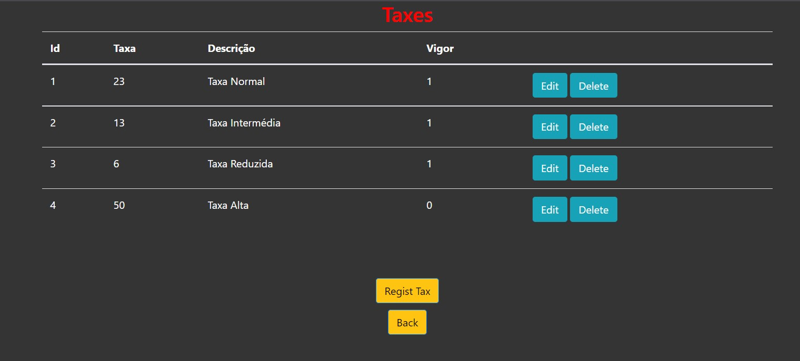
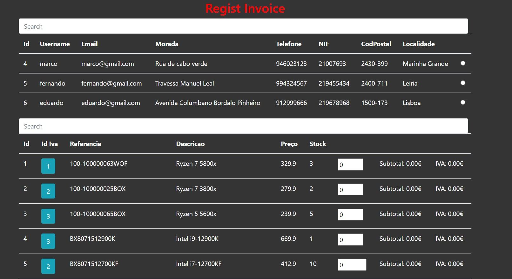
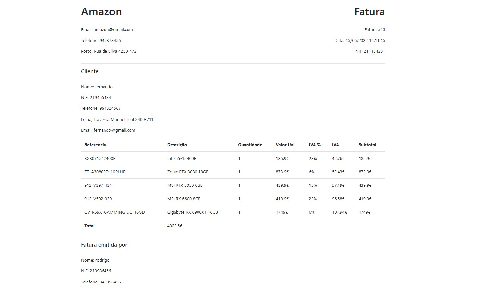

# Project Invoice Generetaor

#### Description:

> This project consists of a website that manages and creates invoices where it is possible to register workers and customers, register products and VAT rates, register a company and register invoices using the same ones where a real invoice is generated.

> Tools Used:
>
> - [HTML5](https://www.w3schools.com/html/)
> - [CSS3](https://www.w3schools.com/css/)
> - [PHP](https://www.php.net/)
> - [Active Record](https://www.phpactiverecord.org/)

### SQL File

> - Projeto_PHP.sql: Table structure and essencial data.

### User Credentials

> Admin:
>
> - Username: admin
> - Password: admin
>
> Workers:
>
> - Username: joao
> - Password: funcionario
>
> - Username: rodrigo
> - Password: funcionario
>
> Clients:
>
> - Username: marco
> - Password: cliente
>
> - Username: fernando
> - Password: cliente

> Each role as difrent permissions.
>
> - Admin: Can create, edit and delete all.
> - Worker: Can Manage Products and VAT Rates, Regist Clients and issue invoices
> - Client: Can see invoices.

## Development Setup

    git clone https://github.com/JoaoJesus1337/InvoiceGenerator.git

- Execut the script `Projeto_PHP.sql`.

## Login Page

    

## Admin Page

    

## Manage Workers

    

## Manage Products

    

## Manage Taxes

    

## Regist Invoice [You can sett different quantaties for each product]

    

## Invoice

    

